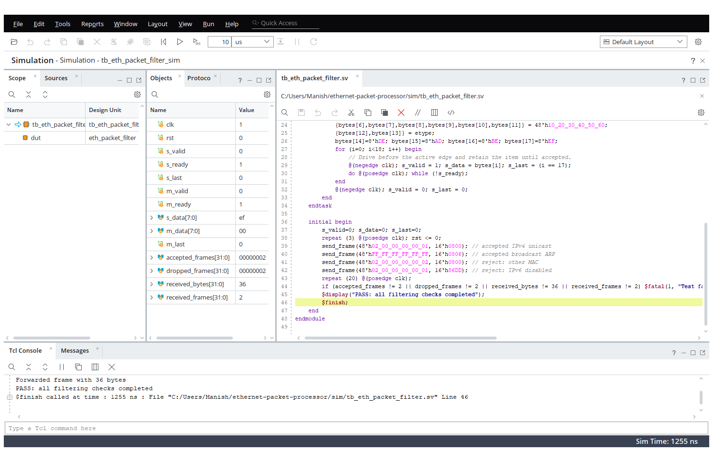

# Ethernet Packet Processor

A synthesizable SystemVerilog Ethernet ingress filter designed as a portfolio project for FPGA and digital/ASIC RTL roles.

## Implemented core

`eth_packet_filter` consumes one byte per cycle on a ready/valid stream, buffers the 14-byte Ethernet header, and then:

- accepts unicast frames addressed to `LOCAL_MAC` or Ethernet broadcast frames;
- permits IPv4 (`0x0800`) and ARP (`0x0806`) EtherTypes;
- forwards accepted frames unchanged;
- discards other frames and malformed runt frames;
- exposes accepted and dropped frame counters.

The core is deliberately MAC/PHY independent. A board integration should attach its RX MAC output to `s_*` and connect `m_*` to an AXI-stream FIFO, packet buffer, DMA engine, or processing pipeline.

## Architecture

```text
RX MAC -> byte-stream input -> 14-byte header buffer -> destination/EtherType filter -> byte-stream output
                                                   |-> drop counter
```

The module applies backpressure correctly on output payload data. Header buffering means packets that will be rejected never appear on the output interface.

## Simulation

The testbench sends four frames: accepted IPv4 unicast, accepted broadcast ARP, wrong-destination IPv4, and unsupported IPv6. It verifies two accepted frames, two dropped frames, and 36 forwarded bytes. The latest passing result is recorded in [RESULTS.md](RESULTS.md).



From the Vivado Tcl console (or Windows command prompt):

```text
vivado -mode batch -source scripts/run_sim.tcl
```

The supplied script targets an Artix-7 XC7A35T only to create an in-memory project; change the part or create a board-specific Vivado project for implementation.

## Suggested extensions

1. Add an Ethernet MAC/PHY wrapper for the target board (RMII/RGMII/GMII).
2. Add VLAN parsing, IPv4 5-tuple extraction, and CAM-backed filtering rules.
3. Add an AXI4-Lite control/status interface and AXI DMA output.
4. Use an asynchronous FIFO at the MAC/core clock boundary.
5. Add constrained-random tests, assertions, code coverage, and timing/resource reports.

## CV wording

Designed and verified a synthesizable SystemVerilog Ethernet ingress packet processor with ready/valid flow control, 14-byte header buffering, MAC/EtherType classification, and hardware frame counters; validated acceptance and drop paths in Vivado simulation.

## License

MIT.
