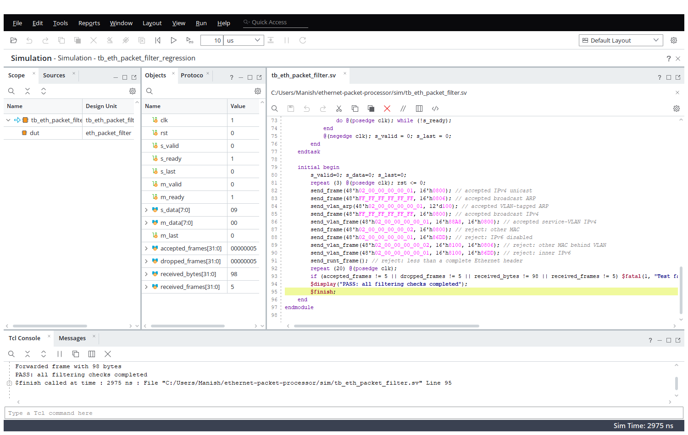
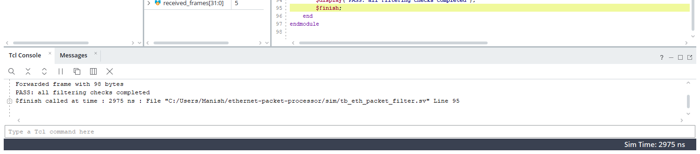

# Ethernet Packet Processor

A synthesizable SystemVerilog Ethernet ingress processing pipeline designed as a portfolio project for FPGA and digital/ASIC RTL roles.

## Implemented core

`eth_ingress_processor` is a composable two-stage pipeline. It accepts one byte per cycle on a ready/valid stream and combines `eth_packet_filter` with `ipv4_metadata_parser`.

- accepts unicast frames addressed to `LOCAL_MAC` or Ethernet broadcast frames;
- permits IPv4 (`0x0800`) and ARP (`0x0806`) EtherTypes;
- forwards accepted frames unchanged;
- discards other frames and malformed runt frames;
- exposes accepted and dropped frame counters.

The expanded pipeline also:

- recognizes one IEEE 802.1Q (`0x8100`) or 802.1ad (`0x88A8`) VLAN tag and preserves it on output;
- extracts IPv4 source/destination addresses, protocol, and TCP/UDP source/destination ports;
- emits a `meta_valid` event with the 5-tuple, VLAN ID, and VLAN-presence flag;
- exposes IPv4, TCP, and UDP frame counters for lightweight traffic telemetry.

The core is deliberately MAC/PHY independent. A board integration should attach its RX MAC output to `s_*` and connect `m_*` to an AXI-stream FIFO, packet buffer, DMA engine, or processing pipeline.

## Architecture

```text
RX MAC -> L2 admission filter -> IPv4/VLAN metadata parser -> byte-stream output
             |                         |-> 5-tuple metadata + protocol counters
             |-> accept/drop counters
```

The modules apply backpressure correctly on payload data. L2 header buffering means packets that will be rejected never appear on the output interface, while the parser observes only accepted frames.

## Simulation

The L2 regression sends ten frames: five accepted frames covering untagged, customer-VLAN, and service-VLAN traffic; plus five rejection cases. It verifies five accepted frames, five dropped frames, and 98 forwarded bytes. The latest passing result is recorded in [RESULTS.md](RESULTS.md).






From the Vivado Tcl console (or Windows command prompt):

```text
vivado -mode batch -source scripts/run_sim.tcl
```

The supplied script targets an Artix-7 XC7A35T only to create an in-memory project; change the part or create a board-specific Vivado project for implementation.

## Suggested extensions

1. Add an Ethernet MAC/PHY wrapper for the target board (RMII/RGMII/GMII).
2. Add VLAN parsing, IPv4 5-tuple extraction, and CAM-backed filtering rules.
3. Add an AXI4-Lite control/status interface and AXI DMA output.
4. Use an asynchronous FIFO at the MAC/core clock boundary.
5. Add constrained-random tests, assertions, code coverage, and timing/resource reports.

## CV wording

Designed and verified a synthesizable SystemVerilog Ethernet ingress packet processor with ready/valid flow control, 14-byte header buffering, MAC/EtherType classification, and hardware frame counters; validated acceptance and drop paths in Vivado simulation.

## License

MIT.
