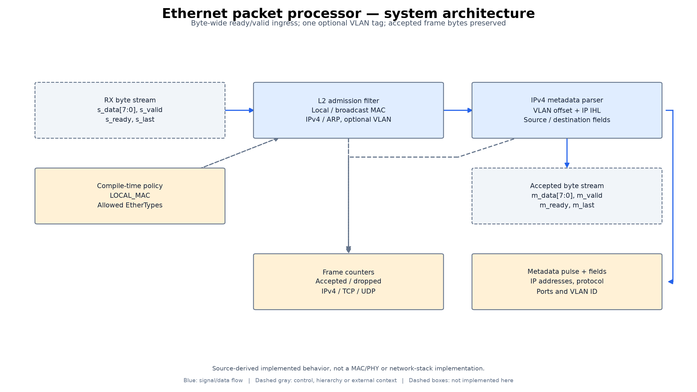
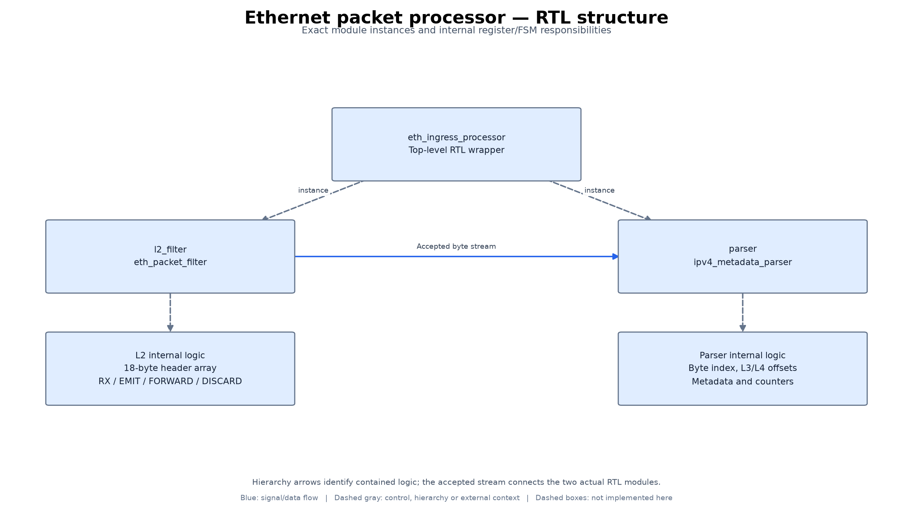
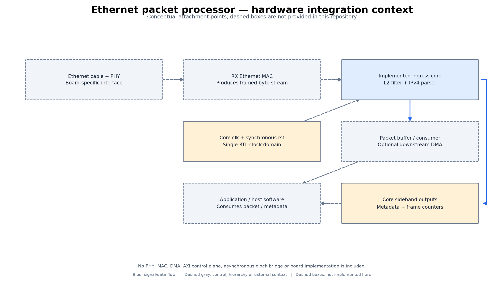

# Architecture and implementation diagrams

Implemented RTL core only; PHY, MAC, DMA and host integration are external. No new synthesis schematic is claimed.

These diagrams were derived from the source files linked below. They are
annotated engineering block diagrams, not Vivado synthesized-netlist exports,
application screenshots, PCB schematics, or newly validated hardware.

## system architecture

Byte-wide ready/valid ingress; one optional VLAN tag; accepted frame bytes preserved.

Source-derived implemented behavior, not a MAC/PHY or network-stack implementation.

[Scalable SVG](diagrams/figures/architecture_overview.svg)

## RTL structure

Exact module instances and internal register/FSM responsibilities.

Hierarchy arrows identify contained logic; the accepted stream connects the two actual RTL modules.

[Scalable SVG](diagrams/figures/rtl_structure.svg)

## hardware integration context

Conceptual attachment points; dashed boxes are not provided in this repository.

No PHY, MAC, DMA, AXI control plane, asynchronous clock bridge or board implementation is included.

[Scalable SVG](diagrams/figures/hardware_context.svg)

## Source mapping and reproduction

Dashed boxes are external integration context, not delivered implementations.
Blue arrows show data/signal flow; dashed gray arrows show control, hierarchy,
or external context. Internal responsibility boxes may represent functions or
register groups rather than separately instantiated modules.

Source files:

- [rtl/eth_ingress_processor.sv](../rtl/eth_ingress_processor.sv)
- [rtl/eth_packet_filter.sv](../rtl/eth_packet_filter.sv)
- [rtl/ipv4_metadata_parser.sv](../rtl/ipv4_metadata_parser.sv)

Source revision: `09ffd9d2ea0006ee4aea53c8e05910f857768d93`. The [provenance manifest](diagrams/provenance.json)
records hashes of the inspected source files. No functional source or existing
simulation results were changed for this documentation update.

To regenerate, install `docs/diagrams/requirements.txt` in a separate Python
environment and run `python docs/diagrams/render.py` from the repository root.
The editable block/connection definitions are in [design.json](diagrams/design.json).
